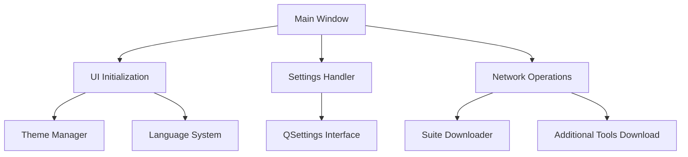

# README.md - Sysinternals Suite GUI
### White (English) GUI


### Black (German) GUI


A user-friendly GUI application for managing and executing Sysinternals Suite tools as well as other useful system programs. The application offers advanced features such as language support, dark mode, program search, and integration of System32 tools.

## Table of Contents
- [Introduction](#introduction)
- [Features](#features)
- [Requirements](#requirements)
- [Installation](#installation)
- [Usage](#usage)
- [Configuration](#configuration)
- [Translations](#translations)
- [System32 Integration](#system32-integration)
- [Developer Notes](#developer-notes)
- [License](#license)
- [Contributors](#contributors)
- [Acknowledgements](#acknowledgements)

## Introduction
This GUI application simplifies access to the tools of the Sysinternals Suite from Microsoft and extends them with additional functions:
- Automatic download/extraction of the Sysinternals Suite
- Integrated descriptions for all tools
- Advanced search function with filtering by name and descriptions
- Support for System32 tools (.exe/.msc)
- Optional integration of external tools (WizTree, Windhawk etc.)
- Dark/Light mode with animated transition
- Multilingual support (DE/EN)

## Features
### Core Features
- **Automatic Suite Management**:  
  Downloads the latest Sysinternals Suite automatically on first start.
  
- **Intelligent Search**:  
  Searches tool names AND description texts in real time.

- **Program Starter**:  
  Starts tools either normally or with admin rights (checkbox).

- **Shortcut Creation**:  
  Creates desktop shortcuts with one click.

- **System32 Integration**:  
  Displays over 50 System32 tools (.exe/.msc) with German/English descriptions.

- **Additional Tools**:  
  One-click download of:
  - WizTree (disk analysis)
  - Windhawk (Windows customizations)
  - Wireshark (network analysis)
  - Recuva (data recovery)
  - File Shredder (secure deletion)

### Advanced Features
- **Persistent Settings**:  
  Remembers language, theme, and checkbox states between sessions.

- **Animated UI**:  
  Smooth color transitions when changing themes.

- **Collapsible Sections**:  
  Organizes "Other Programs" and System32 tools into expandable sections.

- **Multi-Instance Safe**:  
  Allows parallel execution of multiple instances.

- **Error Handling**:  
  Detailed error messages for network problems or file errors.

## Requirements
- **Operating System**: Windows 10/11 (64-Bit)
- **Python**: 3.9 or higher
- **Required Libraries**:
  ```bash
  pip install pyqt5 requests pywin32 ctypes
  ```

## Installation
1. Clone repository:
   ```bash
   git clone https://github.com/Junko666/sysinternals_gui.git
   cd sysinternals-gui
   ```
2. Create virtual environment (recommended):
   ```bash
   python -m venv venv
   venv\Scripts\activate
   ```
3. Install dependencies:
   ```bash
   pip install -r requirements.txt
   ```
4. Start application:
   ```bash
   python main.py
   ```

## Usage
### Main Interface
 <!-- Placeholder -->
1. **Language Selection**: DE/EN via dropdown
2. **Search Field**: Real-time search for tools
3. **Theme Toggle**: Dark/Light mode
4. **Checkboxes**:
   - "Additional Programs": Loads external tools
   - "Admin Rights": Global for all starts
   - "System32 Programs": Shows system tools

### Program Start
- Click "Start" next to a tool:
  - Normal execution: Standard user rights
  - With admin rights: Checkbox active
  - Special tools (e.g. Powertoys): Opens store links

### Shortcut Creation
- Click "Shortcut" next to a tool:
  - Creates shortcut on desktop
  - Shows success message with path

### Additional Programs
1. Activate checkbox "Add additional programs"
2. Wait during download (approx. 1-5 minutes)
3. New tools appear automatically in list

## Configuration
### Persistent Settings
The application saves configuration in the registry under:
`HKEY_CURRENT_USER\Software\SysinternalsGUI\Language`

Manual adjustment possible via:
```python
# main.py line 23
SETTINGS = QSettings("SysinternalsGUI", "Language")
```

### Advanced Options
| Setting               | Registry Key         | Type    | Default |
|---------------------------|----------------------------|--------|----------|
| Language                   | language                   | String | de       |
| Theme                     | theme                      | String | dark     |
| Admin Rights              | always_run_as_admin        | Bool   | False    |
| System32 Programs        | show_system32_programs     | Bool   | False    |

## Translations
### Existing Languages
- German (de)
- English (en)

### Add New Language
1. Extend `TRANSLATIONS` dictionary:
   ```python
   TRANSLATIONS['es'] = {
       'title': "Interfaz de Sysinternals",
       'search_placeholder': "Buscar programas...",
       # ... translate all keys
   }
   ```
2. Add System32 descriptions:
   ```python
   SYSTEM32_DESCRIPTIONS["eventvwr.msc"] = {
       "es": "Visualizador de eventos del sistema."
   }
   ```
3. Add combobox entry:
   ```python
   self.lang_combo.addItem("Español", "es")
   ```

## System32 Integration
### Supported File Types
- **.exe**: Executable system programs
- **.msc**: Microsoft Management Consoles

### Implementation Details
- Automatic detection of all .exe/.msc files in `C:\Windows\System32`
- Dynamic description loading from `SYSTEM32_DESCRIPTIONS`
- Case-insensitive search (works with upper/lower case)

### Example Tools
| Toolname               | Description (DE)                                      |
|------------------------|-------------------------------------------------------|
| `gpedit.msc`           | Group Policy Management                         |
| `diskmgmt.msc`         | Disk Partitioning                            |
| `eventvwr.msc`         | Event Viewer                                       |
| `taskmgr.exe`          | Task Manager                                          |
| `regedit.exe`          | Registry Editor                                  |

## Developer Notes
### Architecture Overview


### Important Code Sections
1. **Download Logic** (`download_and_extract()`)
   - Streamed downloads with progress bar
   - SHA-256 checksum verification (TODO)
   - Automatic cleanup routines

2. **UI Animations** (`ToggleSwitch` class)
   - Custom widget with QPropertyAnimation
   - Smooth circle transition
   - Theme-agnostic design

3. **System32 Handling** (`update_program_list()`)
   - Multithreaded file scan (TODO)
   - Dynamic tooltip generation
   - MSC file execution via `mmc.exe`

### Extension Possibilities
1. **Portable Mode**:  
   Make `SUITE_FOLDER` relative to script path

2. **Update Checker**:  
   Compares local version with online ZIP

3. **Plugin System**:  
   External tool definitions via JSON

## Contributors
1. [Junko666]([https://github.com/Junko666-username](https://github.com/Junko666))
2. OpenAi o3 High | Coding
3. DeepSeek R1 | README.md
   

---

**Note**: This is a community-driven application and not officially affiliated with Microsoft or the Sysinternals Suite.


# README.md - Sysinternals Suite GUI
### Weiße (Englisch) GUI


### Schwarze (German) GUI


Eine benutzerfreundliche GUI-Anwendung zur Verwaltung und Ausführung der Sysinternals Suite-Tools sowie weiterer nützlicher Systemprogramme. Die Anwendung bietet erweiterte Funktionen wie Sprachunterstützung, Dark Mode, Programm-Suche und Integration von System32-Tools.

## Inhaltsverzeichnis
- [Einführung](#einführung)
- [Features](#features)
- [Voraussetzungen](#voraussetzungen)
- [Installation](#installation)
- [Bedienung](#bedienung)
- [Konfiguration](#konfiguration)
- [Übersetzungen](#übersetzungen)
- [System32-Integration](#system32-integration)
- [Entwicklerhinweise](#entwicklerhinweise)
- [Lizenz](#lizenz)
- [Beitragende](#beitragende)
- [Danksagungen](#danksagungen)

## Einführung
Diese GUI-Anwendung vereinfacht den Zugriff auf die Tools der Sysinternals Suite von Microsoft und erweitert sie um zusätzliche Funktionen:
- Automatischer Download/Entpacken der Sysinternals Suite
- Integrierte Beschreibungen für alle Tools
- Erweiterte Suchfunktion mit Filterung nach Namen und Beschreibungen
- Unterstützung für System32-Tools (.exe/.msc)
- Optionale Integration externer Tools (WizTree, Windhawk etc.)
- Dark/Light Mode mit animiertem Übergang
- Mehrsprachige Unterstützung (DE/EN)

## Features
### Kernfunktionen
- **Automatische Suite-Verwaltung**:  
  Lädt die neueste Sysinternals Suite bei Erststart automatisch herunter.
  
- **Intelligente Suche**:  
  Durchsucht Tool-Namen UND Beschreibungstexte in Echtzeit.

- **Programm-Starter**:  
  Startet Tools entweder normal oder mit Admin-Rechten (Checkbox).

- **Shortcut-Erstellung**:  
  Erstellt Desktop-Verknüpfungen mit einem Klick.

- **System32-Integration**:  
  Zeigt über 50 System32-Tools (.exe/.msc) mit deutschen/englischen Beschreibungen an.

- **Zusätzliche Tools**:  
  Ein-Klick-Download von:
  - WizTree (Festplattenanalyse)
  - Windhawk (Windows-Anpassungen)
  - Wireshark (Netzwerkanalyse)
  - Recuva (Datenrettung)
  - File Shredder (sicheres Löschen)

### Erweiterte Funktionen
- **Persistente Einstellungen**:  
  Merkt Sprache, Theme und Checkbox-Zustände zwischen Sessions.

- **Animiertes UI**:  
  Flüssige Farbübergänge beim Theme-Wechsel.

- **Kollabierbare Bereiche**:  
  Organisiert "Andere Programme" und System32-Tools in ausklappbaren Sektionen.

- **Multi-Instance-Sicher**:  
  Parallele Ausführung mehrerer Instanzen möglich.

- **Fehlerbehandlung**:  
  Detaillierte Fehlermeldungen bei Netzwerkproblemen oder Dateifehlern.

## Voraussetzungen
- **Betriebssystem**: Windows 10/11 (64-Bit)
- **Python**: 3.9 oder höher
- **Benötigte Bibliotheken**:
  ```bash
  pip install pyqt5 requests pywin32 ctypes
  ```

## Installation
1. Repository klonen:
   ```bash
   git clone https://github.com/ihr-benutzername/sysinternals-gui.git
   cd sysinternals-gui
   ```
2. Virtuelle Umgebung erstellen (empfohlen):
   ```bash
   python -m venv venv
   venv\Scripts\activate
   ```
3. Abhängigkeiten installieren:
   ```bash
   pip install -r requirements.txt
   ```
4. Anwendung starten:
   ```bash
   python main.py
   ```

## Bedienung
### Hauptoberfläche
 <!-- Platzhalter -->
1. **Sprachauswahl**: DE/EN über Dropdown
2. **Suchfeld**: Echtzeit-Suche nach Tools
3. **Theme-Toggle**: Dark/Light Mode
4. **Checkboxen**:
   - "Zusätzliche Programme": Lädt externe Tools
   - "Admin-Rechte": Global für alle Starts
   - "System32-Programme": Blendet Systemtools ein

### Programmstart
- Klicken Sie auf "Starten" neben einem Tool:
  - Normale Ausführung: Standard-Benutzerrechte
  - Mit Admin-Rechten: Checkbox aktivieren
  - Spezialtools (z.B. Powertoys): Öffnen Store-Links

### Shortcut-Erstellung
- Klicken Sie auf "Shortcut" neben einem Tool:
  - Erstellt Verknüpfung auf dem Desktop
  - Zeigt Erfolgsmeldung mit Pfad an

### Zusätzliche Programme
1. Aktivieren Sie die Checkbox "Zusätzliche Programme hinzufügen"
2. Warten Sie während des Downloads (ca. 1-5 Minuten)
3. Neue Tools erscheinen automatisch in der Liste

## Konfiguration
### Persistente Einstellungen
Die Anwendung speichert Konfiguration in der Registry unter:
`HKEY_CURRENT_USER\Software\SysinternalsGUI\Language`

Manuelle Anpassung möglich über:
```python
# main.py Zeile 23
SETTINGS = QSettings("SysinternalsGUI", "Language")
```

### Erweiterte Optionen
| Einstellung               | Registry-Schlüssel         | Typ    | Standard |
|---------------------------|----------------------------|--------|----------|
| Sprache                   | language                   | String | de       |
| Theme                     | theme                      | String | dark     |
| Admin-Rechte              | always_run_as_admin        | Bool   | False    |
| System32-Programme        | show_system32_programs     | Bool   | False    |

## Übersetzungen
### Vorhandene Sprachen
- Deutsch (de)
- Englisch (en)

### Neue Sprache hinzufügen
1. Erweitern Sie das `TRANSLATIONS`-Dictionary:
   ```python
   TRANSLATIONS['es'] = {
       'title': "Interfaz de Sysinternals",
       'search_placeholder': "Buscar programas...",
       # ... alle Schlüssel übersetzen
   }
   ```
2. Fügen Sie System32-Beschreibungen hinzu:
   ```python
   SYSTEM32_DESCRIPTIONS["eventvwr.msc"] = {
       "es": "Visualizador de eventos del sistema."
   }
   ```
3. Kombobox-Eintrag ergänzen:
   ```python
   self.lang_combo.addItem("Español", "es")
   ```

## System32-Integration
### Unterstützte Dateitypen
- **.exe**: Ausführbare Systemprogramme
- **.msc**: Microsoft Management Consoles

### Implementierungsdetails
- Automatische Erkennung aller .exe/.msc-Dateien in `C:\Windows\System32`
- Dynamische Beschreibungsladung aus `SYSTEM32_DESCRIPTIONS`
- Case-insensitive Suche (funktioniert mit GROSS-/Kleinschreibung)

### Beispiel-Tools
| Toolname               | Beschreibung (DE)                                      |
|------------------------|-------------------------------------------------------|
| `gpedit.msc`           | Gruppenrichtlinien-Verwaltung                         |
| `diskmgmt.msc`         | Festplattenpartitionierung                            |
| `eventvwr.msc`         | Ereignisanzeige                                       |
| `taskmgr.exe`          | Task-Manager                                          |
| `regedit.exe`          | Registrierungseditor                                  |

## Entwicklerhinweise
### Architekturüberblick


### Wichtige Code-Sektionen
1. **Download-Logik** (`download_and_extract()`)
   - Streamed Downloads mit Progress-Bar
   - SHA-256 Checksummenprüfung (TODO)
   - Automatische Cleanup-Routinen

2. **UI-Animationen** (`ToggleSwitch`-Klasse)
   - Custom Widget mit QPropertyAnimation
   - Smooth Circle Transition
   - Theme-agnostisches Design

3. **System32-Handling** (`update_program_list()`)
   - Multithreaded Dateiscan (TODO)
   - Dynamische Tooltip-Generierung
   - MSC-Datei Ausführung via `mmc.exe`

### Erweiterungsmöglichkeiten
1. **Portable Mode**:  
   `SUITE_FOLDER` relativ zum Skript-Pfad machen

2. **Update-Checker**:  
   Vergleicht lokale Version mit Online-ZIP

3. **Plugin-System**:  
   Externe Tool-Definitionen via JSON

## Beitragende
1. [Junko666]([https://github.com/ihr-benutzername](https://github.com/Junko666))
2. OpenAi o3 High | Coding
3. DeepSeek R1 | README.md
   

---

**Hinweis**: Dies ist eine Community-getriebene Anwendung und nicht offiziell mit Microsoft oder der Sysinternals Suite verbunden.
